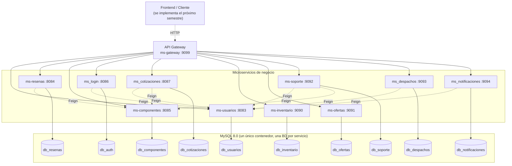

# Arquitectura y modelo de datos — PC Builder

Diagramas en formato [Mermaid](https://mermaid.js.org/), renderizados de forma nativa por GitHub (no requieren herramientas externas).

## Diagrama de arquitectura

Todo el tráfico externo entra por el **API Gateway** (`ms-gateway`, puerto `9099`), que enruta cada petición al microservicio correspondiente según el prefijo del path. Las flechas discontinuas dentro de "Microservicios" representan llamadas Feign (síncronas, HTTP) entre servicios que dependen unos de otros. Cada microservicio tiene su propia base de datos (una por servicio), todas corriendo sobre un único contenedor MySQL 8.0 compartido (`docker-compose.yml`), nunca un esquema compartido entre servicios.

> Nota: `ms-inventario` y `ms-ofertas` no dependen de ningún otro microservicio vía Feign (son CRUD autocontenidos), por eso no tienen flechas salientes en el diagrama.
>
> Nota: la base de datos de `ms_login` se llama `db_auth` (no `db_login`), verificado en `ms_login/src/main/resources/application-dev.yml`.

## Diagrama de modelo de datos

Cada microservicio tiene su propio esquema, independiente del resto. La única relación JPA real (con clave foránea en base de datos) es `Componente → Categoria`, ambas dentro del mismo servicio (`ms-componentes`). El resto de los campos `idUsuario` / `idComponente` que aparecen en otros microservicios (`ms-resenas`, `ms_cotizaciones`, `ms-soporte`, `ms_despachos`, `ms_notificaciones`, `ms-inventario`) son **referencias lógicas por ID a una entidad que vive en otro microservicio y en otra base de datos** — no son claves foráneas reales, no hay integridad referencial a nivel de base de datos; la validación se hace en tiempo de ejecución vía Feign Client contra el servicio dueño del dato.

```mermaid
erDiagram
    USUARIO {
        Long id PK
        String nombre
        String correo UK
        String password
        String rol
    }

    CATEGORIA {
        Long id PK
        String nombre
    }

    COMPONENTE {
        Long id PK
        String nombre
        String marca
        Double precio
        Integer stock
        Long categoria_id FK
    }

    RESENA {
        Long id PK
        String autor
        String comentario
        Integer calificacion
        Long idComponente "ref. lógica a Componente.id, sin FK real"
    }

    COTIZACION {
        Long id PK
        Long idUsuario "ref. lógica a Usuario.id, sin FK real"
        Long idComponente "ref. lógica a Componente.id, sin FK real"
        Integer cantidad
        Double total
    }

    HISTORIAL_LOGIN {
        Long id PK
        String correoUsuario "ref. lógica a Usuario.correo, sin FK real"
        LocalDateTime fechaHora
        String estado
    }

    INVENTARIO {
        Long id PK
        Long idComponente "ref. lógica a Componente.id, sin FK real"
        Integer cantidadDisponible
        String ubicacionBodega
        LocalDateTime ultimaActualizacion
    }

    OFERTA {
        Long id PK
        String codigo UK
        Integer porcentajeDescuento
        boolean activa
    }

    TICKET_SOPORTE {
        Long id PK
        Long idUsuario "ref. lógica a Usuario.id, sin FK real"
        Long idComponente "ref. lógica a Componente.id, sin FK real"
        String descripcion
        String estado
        LocalDateTime fechaCreacion
    }

    DESPACHO {
        Long id PK
        Long idUsuario "ref. lógica a Usuario.id, sin FK real"
        String direccionEnvio
        String empresaTransporte
        String estadoSeguimiento
        LocalDateTime fechaDespacho
    }

    NOTIFICACION {
        Long id PK
        Long idUsuario "ref. lógica a Usuario.id, sin FK real"
        String tipoMensaje
        String contenido
        String estado
        LocalDateTime fechaEnvio
    }

    COMPONENTE }o--|| CATEGORIA : "pertenece a (FK real, mismo microservicio)"
    RESENA }o--|| COMPONENTE : "referencia por ID (otro microservicio)"
    COTIZACION }o--|| USUARIO : "referencia por ID (otro microservicio)"
    COTIZACION }o--|| COMPONENTE : "referencia por ID (otro microservicio)"
    HISTORIAL_LOGIN }o--|| USUARIO : "referencia por correo (otro microservicio)"
    INVENTARIO }o--|| COMPONENTE : "referencia por ID (otro microservicio)"
    TICKET_SOPORTE }o--|| USUARIO : "referencia por ID (otro microservicio)"
    TICKET_SOPORTE }o--|| COMPONENTE : "referencia por ID (otro microservicio)"
    DESPACHO }o--|| USUARIO : "referencia por ID (otro microservicio)"
    NOTIFICACION }o--|| USUARIO : "referencia por ID (otro microservicio)"
```

> `OFERTA` (cupones de descuento en `ms-ofertas`) no referencia ninguna otra entidad: es completamente autocontenida.
> Nombres de entidad y campos tomados directamente de las clases `entity/*.java` de cada módulo (p. ej. `ms-soporte` usa la clase `TicketSoporte`, tabla `soporte_tickets`).
